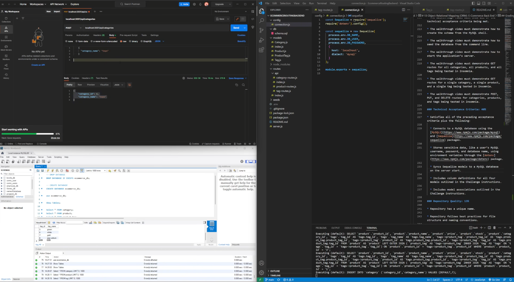

# General Ecommerce Traffic Routing Backend

## Description

This is a routing structure for use in ecommerce front end sites that require inventory controls with relational tags to describe and organize stock

## Table of Contents

- [Installation](#installation)
- [Usage](#usage)
- [Contributing](#contributing)
- [How-to-Contribute](#how-to-contribute)
- [Tests](#tests)
- [Questions](#questions)
- [License](#license)

## Installation

in the root folder run command npm i > npm start. if you require development testing with this app it is recommended that you run npm run seed to seed the database with starter data to see how the app runs. In addition user will need to include enviroment variables in the .env file 

  DB_NAME = <database name>,
  DB_USER = <db username>
  DB_PASSWORD = <db password>

  

## Usage

run the sql schema in the db folder in your choice of mySQL shell and run npm start to spin the server up. see the video in the link below.

## Contributing

n/a

## How-to-contribute

n/a

## Tests

n/a

## Questions

For any questions refer to the MagicCrouton repository https://github.com/MagicCrouton/EcommerceRoutingBackend 
or email inqueries to e.park5336@gmail.com

## License

This application is covered under the MIT license